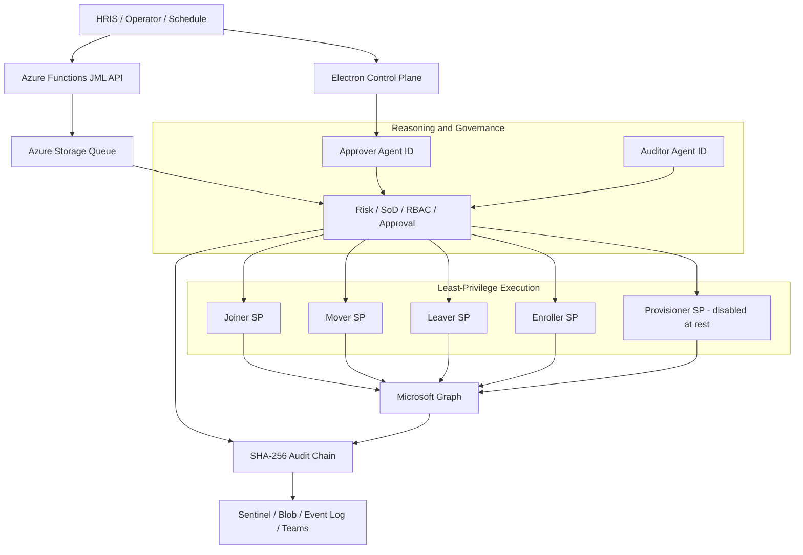

# Architecture

## System Overview



## Component Map

| Component | Path | Purpose |
|---|---|---|
| `Invoke-JoinerProcess.ps1` | `joiner/` | Provisions approved new accounts |
| `Invoke-MoverProcess.ps1` | `mover/` | Applies approved role and department changes |
| `Invoke-LeaverProcess.ps1` | `leaver/` | Runs staged offboarding and evidence capture |
| `Invoke-EnrollerProcess.ps1` | `enroller/` | Handles device and compliance enrollment |
| `approver.js` | `approver/` | Reasoning, tools, risk, and approval workflow |
| `auditor.js` | `auditor/` | Read-only audit and governance investigation |
| `shared/Helpers.ps1` | `shared/` | Authentication, audit, retry, and circuit breaker |
| `api/` | `api/` | Azure Functions HRIS and JML API |
| `worker/` | `worker/` | Queue dispatch, retry, status, and dead-letter handling |
| `electron-app/` | `electron-app/` | Desktop control plane and Glass Screen replay |

## Authentication Pattern

Agents use application-only authentication with no delegated user session.

```text
Approver / Auditor
  blueprint credential -> FMI exchange token -> Agent ID token -> Microsoft Graph

Joiner / Mover / Leaver / Enroller / Provisioner
  certificate -> service-principal token -> Microsoft Graph
  fallback: DPAPI-protected client secret where certificate auth is unavailable
```

Reasoning and read-only investigation use first-class Entra Agent IDs. Microsoft
Entra blocks broad directory-write application roles on Agent IDs, so approved
mutations remain on scoped execution service principals.
