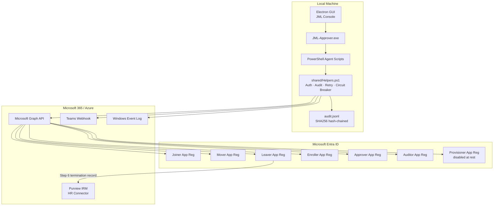

# Architecture

## System Overview



## Component Map

| Component | Path | Purpose |
|---|---|---|
| `Invoke-JoinerProcess.ps1` | `agents/joiner/` | Provisions new accounts |
| `Invoke-MoverProcess.ps1` | `agents/mover/` | Updates attributes on role change |
| `Invoke-LeaverProcess.ps1` | `agents/leaver/` | Full offboarding pipeline + Purview IRM |
| `Invoke-EnrollerProcess.ps1` | `agents/enroller/` | Device/compliance group enrollment |
| `approver.js` + `JML-Approver.exe` | `agents/approver/` | Approval agent with RBAC + dual-approval |
| `auditor.js` + `JML-Auditor.exe` | `agents/auditor/` | Audit log query interface |
| `shared/Helpers.ps1` | `agents/shared/` | Auth, audit, retry, circuit breaker, Teams |
| `electron-app/` | `agents/electron-app/` | Electron desktop console |
| `purview/config.json` | `agents/purview/` | Purview HR Connector credentials |

## Authentication Pattern

All agents use **app-only client credentials**: no interactive sign-in, no delegated permissions.

```
cert-first  → Connect-MgGraph -CertificateThumbprint <thumbprint>
fallback    → Connect-MgGraph -ClientSecretCredential (DPAPI-encrypted)
```