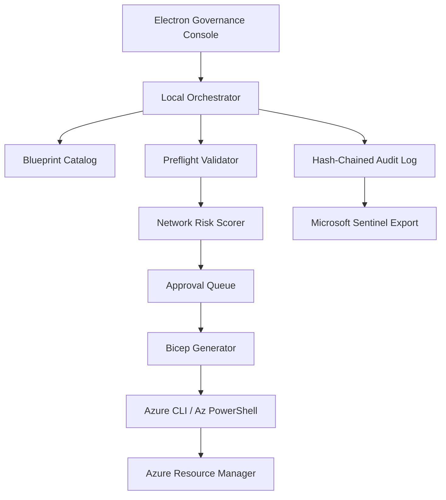

# Azure Network Deployment and Governance Console Plan

## Product Thesis

JML Fleet governs who gets access. The Azure Network Deployment and Governance Console should govern where access can flow. The product should reuse the same operating model: approval-gated changes, risk scoring, drift detection, rollback evidence, and audit-grade reporting.

## Recommended V1 Scope

Build a console for Azure network landing-zone deployment and governance. Keep hybrid/on-prem connectivity and advanced zero-trust posture scoring as follow-on modules unless the first buyer/demo specifically needs them.

### V1 Capabilities

| Capability | Description | Why It Matters |
|---|---|---|
| Network blueprint catalog | Opinionated templates for hub-spoke, single-VNet app zone, private endpoint zone, and inspection zone. | Prevents ad hoc networking and makes deployment repeatable. |
| Preflight validator | Checks naming, CIDR overlap, subnet sizing, region support, DNS requirements, policy conflicts, and required providers. | Catches expensive design mistakes before deployment. |
| Approval-gated deployment | Requires operator approval for high-risk changes such as route changes, firewall policy updates, public IP creation, or peering changes. | Extends the JML control-plane pattern into network change management. |
| Risk scoring | Scores blast radius, exposure, routing impact, policy exceptions, production scope, and rollback confidence. | Gives reviewers a clear reason to approve, warn, or block. |
| IaC generation | Emits Bicep first, with optional Terraform export later. | Bicep aligns naturally with Azure-native demos and avoids early multi-IaC complexity. |
| Deployment runner | Executes WhatIf, deploys to target subscription/resource group, records deployment ID and outputs. | Turns the console into an operator tool, not just a design tool. |
| Drift detection | Compares live Azure state against the approved blueprint and flags changes. | Creates ongoing governance value after initial deployment. |
| Evidence export | Writes JSONL audit, deployment manifest, Azure Activity Log references, and optional Sentinel custom-log events. | Makes the tool credible for compliance and incident review. |

## Architecture

## Core Objects

| Object | Key Fields |
|---|---|
| Blueprint | `name`, `version`, `topology`, `regions`, `addressSpaces`, `subnets`, `dns`, `firewall`, `privateEndpoints`, `policies` |
| Deployment Request | `requestId`, `operator`, `subscriptionId`, `resourceGroup`, `environment`, `blueprintVersion`, `parameters`, `riskScore`, `approvalState` |
| Risk Finding | `category`, `severity`, `message`, `blocking`, `remediation` |
| Drift Finding | `resourceId`, `expected`, `actual`, `severity`, `firstSeen`, `lastSeen` |
| Evidence Bundle | `requestId`, `whatIfResult`, `deploymentId`, `templateHash`, `parametersHash`, `activityLogRefs`, `auditHash` |

## Risk Scoring Dimensions

Use a 0-100 model similar to JML Fleet.

| Dimension | Examples |
|---|---|
| Exposure | Public IP, inbound internet NSG rule, permissive firewall rule, private endpoint missing. |
| Routing blast radius | UDR changes, default route changes, peering transit, forced tunneling. |
| Addressing risk | CIDR overlap, undersized subnet, reserved Azure ranges, conflicting DNS zones. |
| Policy compliance | Missing diagnostics, missing flow logs, non-approved region, untagged production resources. |
| Change context | Production subscription, freeze window, emergency mode, privileged operator. |
| Rollback confidence | WhatIf clean, prior deployment manifest available, existing resources imported or unmanaged. |

## MVP Milestones

1. Blueprint schema and two templates: hub-spoke and single application VNet.
2. Preflight validator with CIDR overlap, required-provider, region, and naming checks.
3. Risk scorer with blocking findings for public exposure and route-table blast radius.
4. Bicep generator with deterministic output and template hashing.
5. WhatIf runner and evidence bundle writer.
6. Approval queue for high-risk deployments.
7. Drift detector for VNets, subnets, NSGs, route tables, peerings, private DNS zones, and private endpoints.
8. Console views: Blueprint, Validate, Risk, Approvals, Deployments, Drift, Evidence, Settings.

## QA Recommendations

1. Unit-test validators with known-good, CIDR-overlap, public-exposure, and invalid-region fixtures.
2. Snapshot-test generated Bicep to prevent accidental template churn.
3. Run `az deployment group what-if` before any deployment and block deploy if WhatIf fails.
4. Use a sandbox subscription for integration tests with a disposable resource group per run.
5. Verify drift detection against both console-created resources and manually changed resources.
6. Export an evidence bundle for every WhatIf and every deployment, including failed runs.
7. Add a release gate that blocks secrets, subscription IDs marked production, and raw Activity Log exports from being committed.

## Positioning

The sellable story is an Azure change-control cockpit for network infrastructure: design from approved blueprints, prove safety before deployment, gate risky changes, deploy consistently, detect drift, and produce audit evidence. That is stronger than a generic "network deployment tool" because it connects engineering execution to governance.
