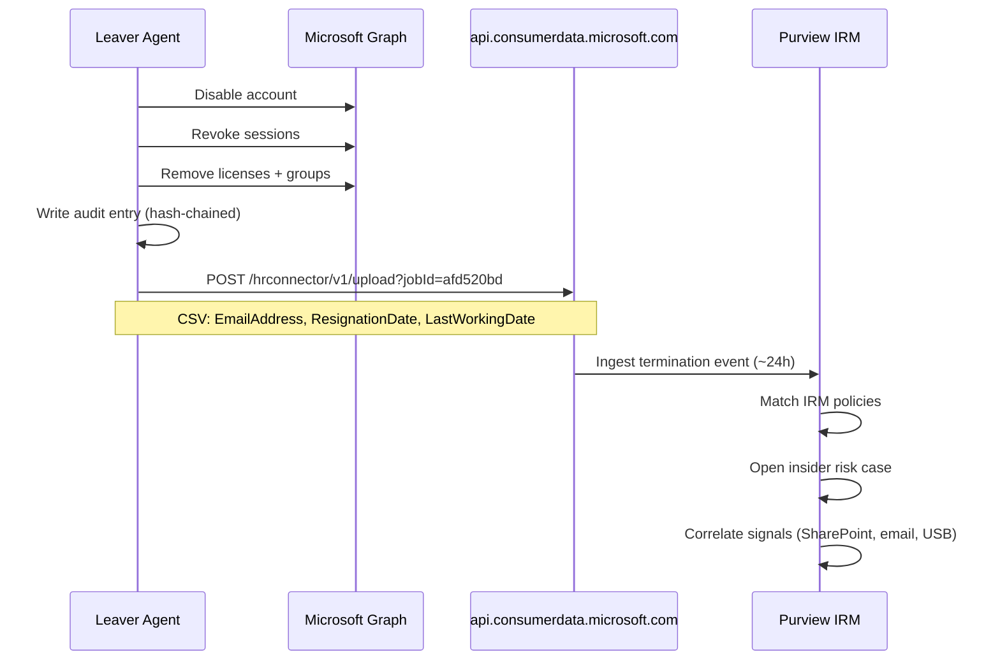

# Purview IRM Integration

## Overview

The leaver agent automatically submits a termination record to the Microsoft Purview HR Connector on every leaver run (Step 6). Purview Insider Risk Management ingests it within ~24h and opens a risk case if a matching IRM policy fires, enabling automated correlation of offboarding events with data exfiltration signals.

## Sequence



## Configuration

| Property | Value |
|---|---|
| Connector app | JML-PurviewHRConnector |
| Client ID | `<PURVIEW-APP-CLIENT-ID>` |
| Job ID | `afd520bd-c2ce-4087-915c-8b6ba6757b54` |
| Config file | `agents/purview/config.json` |
| Token scope | `https://api.consumerdata.microsoft.com/.default` |

## CSV Schema

```csv
EmailAddress,ResignationDate,LastWorkingDate
user@domain.com,2026-05-07T00:00:00Z,2026-05-07T00:00:00Z
```

## Failure Behavior

Non-fatal: a Purview submission failure logs `[WARN]` and the leaver process exits normally. Offboarding is never blocked by a Purview error.

## Setup

```powershell
# 1. Provision app reg + config
.\agents\provisioner\New-PurviewHRConnector.ps1

# 2. Go to compliance.microsoft.com
#    Data connectors → HR → Set up connector
#    Enter Client ID + Tenant ID from script output
#    Paste the Job ID into agents/purview/config.json
```