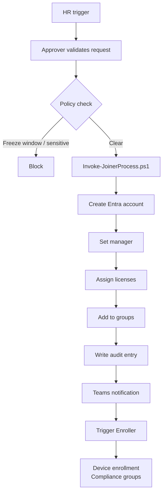
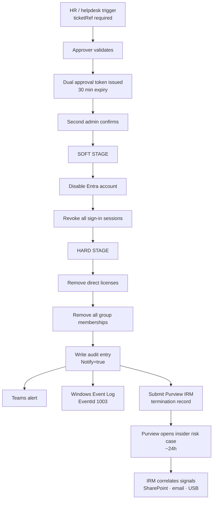
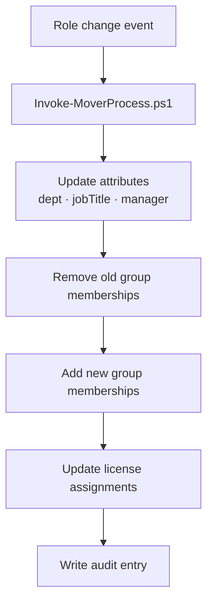
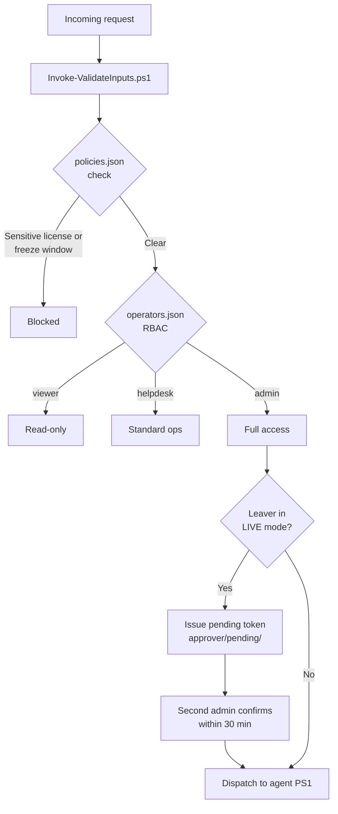
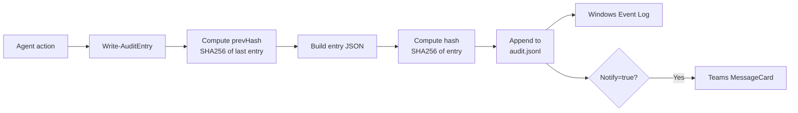

# Workflows

## Joiner Flow

```mermaid
flowchart TD
    A[HR trigger] --> B[Approver validates request]
    B --> C{Policy check}
    C -->|Freeze window / sensitive| D[Block]
    C -->|Clear| E[Invoke-JoinerProcess.ps1]
    E --> F[Create Entra account]
    F --> G[Set manager]
    G --> H[Assign licenses]
    H --> I[Add to groups]
    I --> J[Write audit entry]
    J --> K[Teams notification]
    K --> L[Trigger Enroller]
    L --> M[Device enrollment\nCompliance groups]
```

## Leaver Flow

```mermaid
flowchart TD
    A[HR / helpdesk trigger\nticketRef required] --> B[Approver validates]
    B --> C[Dual approval token issued\n30 min expiry]
    C --> D[Second admin confirms]
    D --> E[SOFT STAGE]
    E --> F[Disable Entra account]
    F --> G[Revoke all sign-in sessions]
    G --> H[HARD STAGE]
    H --> I[Remove direct licenses]
    I --> J[Remove all group memberships]
    J --> K[Write audit entry\nNotify=true]
    K --> L[Teams alert]
    K --> M[Windows Event Log\nEventId 1003]
    K --> N[Submit Purview IRM\ntermination record]
    N --> O[Purview opens insider risk case\n~24h]
    O --> P[IRM correlates signals\nSharePoint · email · USB]
```

## Mover Flow

```mermaid
flowchart TD
    A[Role change event] --> B[Invoke-MoverProcess.ps1]
    B --> C[Update attributes\ndept · jobTitle · manager]
    C --> D[Remove old group memberships]
    D --> E[Add new group memberships]
    E --> F[Update license assignments]
    F --> G[Write audit entry]
```

## Approval Gate

```mermaid
flowchart TD
    A[Incoming request] --> B[Invoke-ValidateInputs.ps1]
    B --> C{policies.json\ncheck}
    C -->|Sensitive license or\nfreeze window| D[Blocked]
    C -->|Clear| E{operators.json\nRBAC}
    E -->|viewer| F[Read-only]
    E -->|helpdesk| G[Standard ops]
    E -->|admin| H[Full access]
    H --> I{Leaver in\nLIVE mode?}
    I -->|Yes| J[Issue pending token\napprover/pending/]
    J --> K[Second admin confirms\nwithin 30 min]
    K --> L[Dispatch to agent PS1]
    I -->|No| L
```

## Audit Flow

```mermaid
flowchart LR
    A[Agent action] --> B[Write-AuditEntry]
    B --> C[Compute prevHash\nSHA256 of last entry]
    C --> D[Build entry JSON]
    D --> E[Compute hash\nSHA256 of entry]
    E --> F[Append to\naudit.jsonl]
    F --> G[Windows Event Log]
    F --> H{Notify=true?}
    H -->|Yes| I[Teams MessageCard]
```